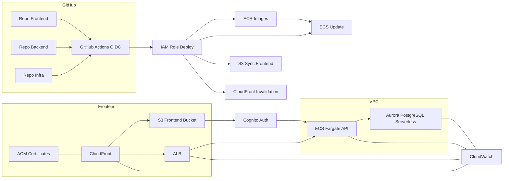

# AWS + GitHub — Reference Architecture (v0-min with CDN, TLS, Logs)

> Compact, production-leaning baseline with **ACM certificates**, **CloudFront**, **CloudWatch**, and **GitHub OIDC** in the pipeline. Excludes Route 53, WAF, KMS, CloudTrail, EventBridge, SQS, OpenSearch, and external LLMs for simplicity.

---

## High-Level Diagram

---

## Executive Summary

- **Frontend**: React app compiled and uploaded to **S3**, served globally via **CloudFront** with **ACM** for HTTPS.  
- **Backend**: Python packaged in Docker, images in **ECR**, service runs on **ECS Fargate** behind **ALB**.  
- **Database**: **Aurora PostgreSQL Serverless** as the relational store.  
- **Auth**: **Cognito** optional (JWT to API) — keep or remove based on your login plan.  
- **Observability**: **CloudWatch** for logs and basic metrics.  
- **CI/CD**: **GitHub Actions with OIDC** assumes a deploy role to push to ECR, update ECS, sync S3, and invalidate CloudFront.

---

## CI/CD Pipelines (what actually happens)

### Frontend pipeline
1. Install dependencies and build the React app (`npm ci && npm run build`).  
2. Configure AWS via GitHub Actions **OIDC** and assume **IAM Role Deploy**.  
3. `aws s3 sync` the build folder to the **S3 Frontend Bucket**.  
4. Trigger a **CloudFront invalidation** for changed paths (or use versioned assets).

### Backend pipeline
1. Build a Docker image for the Python API.  
2. Authenticate to **ECR** and push the image tagged with commit SHA.  
3. Register or update the **ECS task definition** referencing the new image tag.  
4. **Update ECS Service** behind the **ALB** (rolling update with health checks).  
5. Basic smoke tests. Roll back on failure.

> Since we are declaring OIDC even if you are not using it yet, the YAML will show the OIDC step. If you use static keys temporarily, swap the credential step accordingly.

---

## Components (what and why)

### CloudFront and ACM
- **CloudFront** provides global cache and fast delivery for your static site, plus a stable HTTPS endpoint.  
- **ACM** issues the TLS certificate used by CloudFront. This gives proper HTTPS without managing cert files.

### S3 Frontend Bucket
- Holds the compiled React app. Public access is blocked; CloudFront reads the bucket using an origin identity or policy.

### ALB and ECS Fargate
- **ALB** routes HTTP requests to the API tasks. Later you can add path routing or multiple services.  
- **ECS Fargate** runs containers without servers to manage. Good default for APIs and small background jobs.

### Aurora PostgreSQL Serverless
- Managed Postgres with automatic capacity adjustments and minimal ops. Start small, scale when needed.

### CloudWatch
- Central place for logs and metrics. ECS tasks should ship logs here so you can debug deploys and runtime errors.

### Cognito (optional)
- If you need hosted login and JWT issuance, Cognito is a simple start. If not needed yet, you can remove it and keep the API open or behind basic auth.

---

## Minimal IAM needed (conceptual)

- **Deploy role** (assumed from GitHub OIDC): ECR push, ECS update service and task definition, S3 sync to the frontend bucket, CloudFront invalidation.  
- **Task role** (runtime): read secrets if needed, network access to the DB, write logs to CloudWatch.  
- **Execution role** (ECS): pull from ECR, write to CloudWatch logs.

> We can provide exact IAM policies once names and ARNs are chosen.

---

## Environments and naming (examples)

- **Buckets**: `org-frontend-prod`  
- **ECR repos**: `org/backend-api`  
- **ECS service**: `svc-api-prod`  
- **DB**: `aurora-postgres-prod`  
- **CloudFront distribution**: `cf-frontend-prod`  
- **IAM roles**: `deploy-role`, `taskrole-api-prod`, `executionrole-ecs`

---

## Next decisions to confirm

1. **Region** (suggestion: `us-east-1`).  
2. **Auth** now vs later (keep Cognito or remove for v0).  
3. **Environments** (start with prod-only or add staging).  
4. **Credentials**: use OIDC for real vs temporary static keys in repo secrets.

---

## Extended Overview (general and more exhaustive)

This baseline separates **delivery** of the static site from **execution** of the API. The **frontend** compiles into static assets that live in **S3**. **CloudFront** sits in front to provide global caching and HTTPS with **ACM**. This keeps the site fast worldwide and avoids certificate management.

On the **backend**, requests come through an **ALB** into **ECS Fargate** tasks running your Python container. You push images to **ECR**, update the service, and ECS handles the rollout. With this you avoid managing servers, AMIs, and patching. The database is **Aurora PostgreSQL Serverless**, giving you the Postgres ecosystem with fewer knobs: connections, migrations and extensions remain familiar.

For **observability**, **CloudWatch** is the first stop: container logs, ALB access logs (optional), and basic metrics. It is enough to troubleshoot deploys and understand resource use. Later, you can add tracing and dashboards.

In **CI/CD**, we favor **OIDC** to avoid static AWS keys inside GitHub, but if you need to start with secrets, that is workable; just keep permissions tight and rotate keys. Pipelines are intentionally simple: build, push, update. Frontend adds an invalidation to ensure users see new assets quickly.

Security and governance can grow with the product. You can introduce **WAF**, **CloudTrail**, and **KMS** when you need advanced controls. For now, staying lean avoids complexity while keeping good defaults like HTTPS, private buckets, and least-privilege roles.

Finally, the design leaves room for **future additions**: caching with Redis, async jobs with SQS or Step Functions, and vector search engines if you later add embedding-based features. None of these are required to launch the initial product, which is why they are not shown here.
