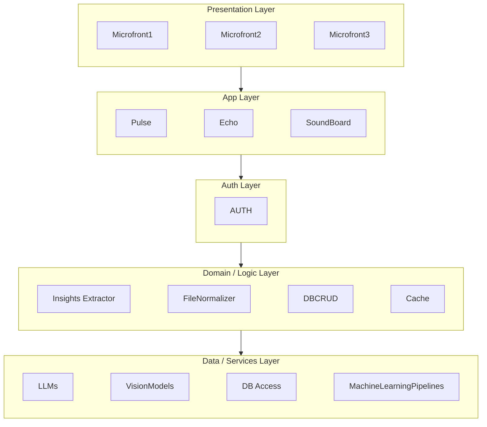

# Arquitectura (n-layer con comunicación HTTP y futura integración MCP)

La solución se inspira en una arquitectura por capas (n-layer) pero todos los módulos se comunican entre sí mediante HTTP (REST/JSON por defecto). En una fase futura, ciertos clientes técnicos podrán acceder directamente a la Domain Layer vía MCP (Model Context Protocol) para invocar capacidades del dominio de forma segura y trazable, saltando la serialización HTTP cuando corresponda (p. ej., herramientas/agents).

## Diagrama general

## Responsabilidades por módulo (conciso)
### Auth Layer

- AUTH: seguridad y autenticación. Emite/valida credenciales y autoriza llamadas HTTP entre capas.

### Domain / Logic Layer

- Insights Extractor: extrae insights a partir de texto ya normalizado; devuelve estructuras listas para usar por las apps.

- FileNormalizer: recibe audio, video, PDF e imágenes y produce texto comprensible por un LLM (incluye transcripción/OCR/limpieza).

- DBCRUD: expone operaciones CRUD del dominio vía HTTP y delegan el acceso físico a DB Access.

- Cache: provee caché de respuestas/datos intermedios para reducir latencia y costo (invalida por claves/reglas simples).

### Data / Services Layer

- LLMs: hoy actúa como wrapper de OpenAI; a futuro permitirá enrutar a múltiples LLMs (selección por tarea/costo/latencia).

- Vision (VisionModels): hoy wrapper básico; a futuro multi-proveedor de modelos de visión (clasificación, OCR avanzado, VLM).

- DB Access: recibe peticiones de DBCRUD y las rutea a la base correspondiente (p. ej., por esquema, tenant o tipo de dato).

- MachineLearning (MLPipelines): encapsula la lógica y pipelines de ML propios del producto (entrenamiento/inferencia básica por ahora).

### Notas operativas

Contrato de comunicación: interfaces HTTP claras entre capas (recursos, verbos y códigos de estado).

Evolución MCP: cuando esté habilitado, MCP permitirá a tools/agents invocar funciones del Domain Layer sin pasar por endpoints HTTP, manteniendo auditoría y policies equivalentes a AUTH.

Separación de responsabilidades: Presentation y App no acceden a Data directamente; todo pasa por AUTH → Domain, preservando el modelo de dominio y las políticas.

