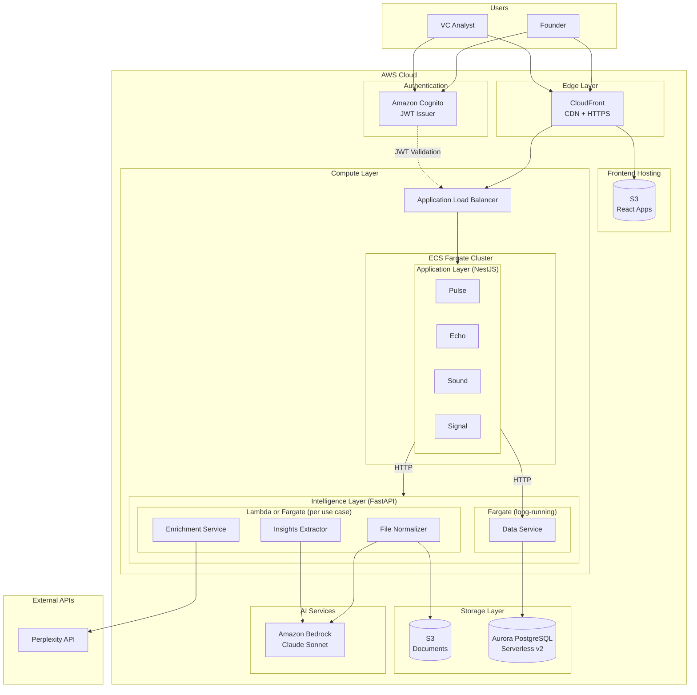

# Xylence Platform — System Architecture

> **Predictive Intelligence Platform for Venture Capital**  
> Version: 2.0 | Author: Lucas | Date: December 2025

---

## Table of Contents

1. [Architecture Overview](#1-architecture-overview)
2. [Layer Specification](#2-layer-specification)
3. [Module Deep Dives](#3-module-deep-dives)
4. [Data Architecture](#4-data-architecture)
5. [Infrastructure & Deployment](#5-infrastructure--deployment)
6. [Security & Multi-tenancy](#6-security--multi-tenancy)
7. [Repository Structure](#7-repository-structure)
8. [Risks & Mitigations](#8-risks--mitigations)
9. [Appendix](#9-appendix)

---

## 1. Architecture Overview

### Platform Modules

The platform consists of four main application modules, each serving a distinct purpose in the investment intelligence workflow:

| Module | Purpose | Users |
|--------|---------|-------|
| **Pulse** | Intelligent intake: converts founder applications into structured, enriched profiles | Founders, VCs |
| **Echo** | Founder-facing advisor: presents insights, enables Q&A, collects behavioral signals | Founders |
| **Sound** | VC-facing cockpit: ranked dealflow, portfolio views, explanations | VC Analysts, Partners |
| **Signal** | Matchmaking engine: connects founders with relevant investors and vice versa | Both |

### Layered Architecture
 
The platform follows an **n-layer architecture** with HTTP communication between layers. Each layer has clear responsibilities and dependencies flow strictly downward.


## El grafico deberia tener una distribucion horizontal


### Design Principles

| Principle | Implementation |
|-----------|----------------|
| **Separation of Concerns** | Each layer has a single responsibility; no layer skips another |
| **HTTP Communication** | All inter-layer calls use REST/JSON over HTTP |
| **Stateless Services** | All state persists in Aurora; services can scale horizontally |
| **Single Data Access Point** | Only the Data Service in Intelligence Layer reads/writes to Aurora |
| **Multi-tenant Isolation** | Row-Level Security (RLS) enforced at database level |

### Request Flow Example

```
Founder uploads pitch deck:

1. [Presentation]  Founder Portal → POST /api/documents/upload
2. [Application]   Pulse Service receives request, validates JWT via Cognito
3. [Application]   Pulse generates presigned URL for S3, returns to client
4. [Presentation]  Client uploads file directly to S3
5. [Application]   Pulse orchestrates processing pipeline:
   5a. Calls FileNormalizer → extracts text from PDF (uses Bedrock Claude Vision)
   5b. Calls InsightsExtractor → generates structured facts (uses Bedrock Claude)
   5c. Calls EnrichmentService → fetches founder info (uses Perplexity)
   5d. Calls DataService → persists startup profile to Aurora
6. [Application]   Pulse returns success response with startup_id
```

---

## 2. Layer Specification

### 2.1 Presentation Layer

**Purpose**: User interfaces for founders and investors.

| Frontend | Technology | Description |
|----------|------------|-------------|
| `front-pulse` | React + TypeScript | Application submission, document upload |
| `front-echo` | React + TypeScript | Founder dashboard, insights, Q&A |
| `front-sound` | React + TypeScript | VC dashboard, dealflow, analytics |

**Deployment**: Static assets in S3, served via CloudFront.

**Authentication**: Cognito-issued JWT tokens, validated on each request.

### 2.2 Application Layer

**Purpose**: Business logic orchestration, workflow coordination, API composition.

| Service | Technology | Responsibility |
|---------|------------|----------------|
| **Pulse** | NestJS (TypeScript) | Orchestrates intake pipeline, coordinates Intelligence Layer calls |
| **Echo** | NestJS (TypeScript) | Manages founder interactions, serves insights, handles Q&A |
| **Sound** | NestJS (TypeScript) | Serves VC dashboards, manages portfolio views, rankings |
| **Signal** | NestJS (TypeScript) | Computes matches, serves recommendations |

**Why NestJS?**
- Reduces friction with React frontends (same language ecosystem)
- Built-in WebSocket support for real-time features
- Strong typing with TypeScript
- Familiar patterns for the team

**Key Characteristics**:
- Orchestrates calls to Intelligence Layer services
- Validates requests and enforces business rules
- Stateless—all persistence delegated to Intelligence Layer
- Deployed on ECS Fargate

### 2.3 Intelligence Layer

**Note**: We could use lambda for some modules

**Purpose**: Domain logic, AI/ML capabilities, data access abstraction.

| Service | Technology | Responsibility |
|---------|------------|----------------|
| **Insights Extractor** | Python + FastAPI | Extracts structured facts and insights from text using Claude |
| **File Normalizer** | Python + FastAPI | Converts documents to text (OCR, transcription) using Claude Vision |
| **Data Service** | Python + FastAPI | CRUD operations on Aurora; **only service that touches the database** |
| **Enrichment Service** | Python + FastAPI | Fetches external data (founder info, news) via Perplexity |

**Critical Design Decision**: The Data Service is the **exclusive gateway** to Aurora PostgreSQL. No other service reads or writes directly. This ensures:
- Consistent tenant isolation enforcement
- Centralized audit logging
- Schema evolution without breaking consumers
- Single point for caching strategies

### 2.4 Data Layer

**Purpose**: Persistence and external AI services.

| Component | Service | Purpose |
|-----------|---------|---------|
| **Primary Database** | Aurora PostgreSQL Serverless v2 | Structured data with RLS |
| **Object Storage** | Amazon S3 | Raw documents, processed PDFs |
| **LLM Inference** | Amazon Bedrock (Claude) | Text analysis, fact extraction, document understanding |

---

## 3. Module Deep Dives

### 3.1 Pulse — Intelligent Intake

**Vision**: The entry point for every founder application. Reduces time-to-apply for founders and time-to-structure for investors.

**Responsibilities**:

| Responsibility | Description |
|----------------|-------------|
| **Rapid Application** | Enable founders to apply quickly with minimal friction |
| **Information Structuring** | Convert unstructured documents into structured startup profiles |
| **Enrichment** | Augment founder-provided data with external sources |
| **Persistence** | Store all data via Data Service for downstream consumption |

**Internal Architecture**:

```
┌─────────────────────────────────────────────────────────────────────────┐
│                         PULSE SERVICE (NestJS)                          │
├─────────────────────────────────────────────────────────────────────────┤
│                                                                         │
│  ┌──────────────┐  ┌──────────────┐  ┌──────────────┐                  │
│  │   API Layer  │  │  Orchestrator │  │   S3 Client  │                  │
│  │              │  │              │  │              │                  │
│  │ • /documents │  │ • Pipeline   │  │ • Presigned  │                  │
│  │ • /startups  │  │   sequencing │  │   URLs       │                  │
│  │ • /founders  │  │ • Error      │  │ • Upload     │                  │
│  │              │  │   handling   │  │   tracking   │                  │
│  └──────────────┘  └──────────────┘  └──────────────┘                  │
│         │                 │                                             │
│         └────────────────┬┘                                             │
│                          ▼                                              │
│  ┌─────────────────────────────────────────────────────────────────┐   │
│  │                    Intelligence Layer Clients                    │   │
│  │                                                                  │   │
│  │  ┌─────────────┐ ┌─────────────┐ ┌─────────────┐ ┌───────────┐  │   │
│  │  │ FileNorm    │ │ Insights    │ │ Enrichment  │ │ Data      │  │   │
│  │  │ Client      │ │ Client      │ │ Client      │ │ Client    │  │   │
│  │  └─────────────┘ └─────────────┘ └─────────────┘ └───────────┘  │   │
│  └─────────────────────────────────────────────────────────────────┘   │
│                                                                         │
└─────────────────────────────────────────────────────────────────────────┘
                                    │
                                    ▼ HTTP
┌─────────────────────────────────────────────────────────────────────────┐
│                      INTELLIGENCE LAYER (FastAPI)                       │
├─────────────────────────────────────────────────────────────────────────┤
│                                                                         │
│  ┌─────────────────┐  ┌─────────────────┐  ┌─────────────────┐         │
│  │ File Normalizer │  │ Insights        │  │ Enrichment      │         │
│  │                 │  │ Extractor       │  │ Service         │         │
│  │ • PDF → Text    │  │ • Facts extract │  │ • Perplexity    │         │
│  │ • Claude Vision │  │ • Claude LLM    │  │   queries       │         │
│  │ • OCR fallback  │  │ • Schema valid  │  │ • News search   │         │
│  └─────────────────┘  └─────────────────┘  └─────────────────┘         │
│                                                                         │
│  ┌─────────────────────────────────────────────────────────────────┐   │
│  │                        Data Service                              │   │
│  │                                                                  │   │
│  │  • CRUD for all entities    • RLS enforcement                   │   │
│  │  • Transaction management   • Audit logging                     │   │
│  └─────────────────────────────────────────────────────────────────┘   │
│                                    │                                    │
└────────────────────────────────────┼────────────────────────────────────┘
                                     ▼
                            ┌─────────────────┐
                            │ Aurora PostgreSQL│
                            └─────────────────┘
```

**Processing Pipeline**:

```
Document Upload → Normalize → Extract → Enrich → Persist
     │               │           │          │         │
     ▼               ▼           ▼          ▼         ▼
   S3 Raw      Claude Vision   Claude    Perplexity   Aurora
              (text extraction) (facts)  (founders)
```

### 3.2 Echo — Founder Advisor

**Vision**: An expert advisor for founders that presents their information clearly and delivers actionable insights.

**Responsibilities**:

| Responsibility | Description |
|----------------|-------------|
| **Information Presentation** | Display founder's startup profile and application status |
| **Insights Delivery** | Surface insights generated by the platform (from Pulse, Signal, Whisper) |
| **Query Interface** | Allow founders to ask questions about their profile and market |

**Key Features**:
- Dashboard with startup profile completeness
- Insights cards (strengths, risks, suggestions)
- Q&A interface for natural language queries
- Application status tracking

### 3.3 Sound — VC Cockpit

**Vision**: An expert advisor for investors that surfaces opportunities and supports decision-making.

**Responsibilities**:

| Responsibility | Description |
|----------------|-------------|
| **Dealflow Management** | Present ranked list of startup applications |
| **Profile Access** | Detailed startup views with all extracted information |
| **Insights Delivery** | Surface predictions and explanations (from Whisper, Signal) |
| **Query Interface** | Natural language access to portfolio and pipeline data |

**Key Features**:
- Ranked dealflow with filtering/sorting
- Startup detail pages with facts, insights, enrichment
- Comparison views
- Natural language search across portfolio

### 3.4 Signal — Matchmaking Engine

**Vision**: Maximizes founder funding success and investor ROI through intelligent matching.

**Responsibilities**:

| Responsibility | Description |
|----------------|-------------|
| **Founder Recommendations** | Suggest investors likely to be interested |
| **Investor Recommendations** | Surface high-potential founders matching fund thesis |
| **Opportunity Alerts** | Notify both sides of relevant matches |

---

## 4. Data Architecture

```
╔══════════════════════════════════════════════════════════════════════════════╗
║                                                                              ║
║   ⚠️  PROVISIONAL SCHEMA — PENDING DATA TEAM REVIEW                          ║
║                                                                              ║
║   This section outlines the general data structure direction.                ║
║   Final entity definitions, relationships, and field specifications         ║
║   will be determined in collaboration with the Data team.                    ║
║                                                                              ║
╚══════════════════════════════════════════════════════════════════════════════╝
```

### 4.1 Confirmed: Pitch Deck Extraction Schema

The following schema is **defined and validated** for structured data extraction from pitch decks. This is the output of the Insights Extractor service:

| Field | Type | Description |
|-------|------|-------------|
| `problem_statement` | string | Pain point the startup solves |
| `purpose` | string | Mission/objective declaration |
| `solution` | string | Product/service value proposition |
| `business_model` | string | Revenue mechanism (who pays, how) |
| `go_to_market` | string | Customer acquisition strategy |
| `competitive_advantage` | string | Key differentiators |
| `traction` | string | Operational/commercial evidence |
| `financials_ask` | float \| string | Funding amount sought |
| `tam` | float | Total Addressable Market size |
| `tam_units` | string | TAM unit (USD, MXN, users, etc.) |
| `founders` | string | Founding team info and roles |

### 4.2 Indicative Entities (To Be Defined)

Core entities expected in the system:

```
TENANTS ──┬──▶ STARTUPS ──┬──▶ FOUNDERS
          │               ├──▶ DOCUMENTS
          │               └──▶ EXTRACTED_DATA (pitch schema above)
          │
          └──▶ USERS
```

Detailed field definitions, relationships, and additional entities will be specified by the Data team.

### 4.3 Multi-Tenant Isolation

All tables will include `tenant_id` with Row-Level Security (RLS) enforcement:

```sql
ALTER TABLE startups ENABLE ROW LEVEL SECURITY;

CREATE POLICY tenant_isolation ON startups
    USING (tenant_id = current_setting('app.tenant_id')::UUID);
```

The Data Service sets the tenant context on every request based on the authenticated user's JWT claims.

### 4.4 Data Access Pattern

**Critical constraint**: Only the Data Service reads/writes to Aurora.

```
┌─────────────────────────────────────────────────────────────────┐
│                     DATA ACCESS FLOW                            │
├─────────────────────────────────────────────────────────────────┤
│                                                                 │
│   App Layer          Intelligence Layer         Data Layer     │
│   (NestJS)              (FastAPI)              (PostgreSQL)    │
│                                                                 │
│   ┌────────┐         ┌─────────────┐         ┌───────────┐     │
│   │ Pulse  │──HTTP──▶│ Data Service│──SQL───▶│  Aurora   │     │
│   │ Echo   │         │             │         │           │     │
│   │ Sound  │         │ • Set tenant│         │ • RLS     │     │
│   │ Signal │         │ • Validate  │         │ • Enforce │     │
│   └────────┘         │ • Execute   │         └───────────┘     │
│                      └─────────────┘                            │
│                            ▲                                    │
│                            │                                    │
│                   ONLY ACCESS POINT                             │
│                                                                 │
└─────────────────────────────────────────────────────────────────┘
```

---

## 5. Infrastructure & Deployment

### 5.1 AWS Architecture


### 5.2 Service Configuration

| Service | Runtime | vCPU | Memory | Replicas |
|---------|---------|------|--------|----------|
| Pulse | NestJS | 0.5 | 1 GB | 2 |
| Echo | NestJS | 0.5 | 1 GB | 1 |
| Sound | NestJS | 0.5 | 1 GB | 1 |
| Signal | NestJS | 0.5 | 1 GB | 1 |
| File Normalizer | FastAPI | 0.5 | 1 GB | 2 |
| Insights Extractor | FastAPI | 0.5 | 1 GB | 2 |
| Enrichment Service | FastAPI | 0.25 | 512 MB | 1 |
| Data Service | FastAPI | 0.5 | 1 GB | 2 |

---

## 6. Security & Multi-tenancy

### 6.1 Authentication Flow


### 6.2 Security Layers

| Layer | Mechanism |
|-------|-----------|
| **Edge** | CloudFront (DDoS), HTTPS only |
| **Network** | VPC private subnets, security groups |
| **Authentication** | Cognito JWT validation |
| **Authorization** | Role-based access in App Layer |
| **Data Isolation** | PostgreSQL RLS per tenant |
| **Encryption** | TLS in transit, AES-256 at rest |

### 6.3 Role Model

| Role | Access |
|------|--------|
| `founder` | Own startup data via Echo |
| `analyst` | All tenant startups via Sound (read) |
| `partner` | All tenant startups via Sound (read/write) |
| `admin` | Tenant configuration, user management |

---

## 7. Repository Structure

Multi-repo architecture with clear ownership boundaries:

```
xylence/
│
├── front-pulse/          # React - Founder application portal
├── front-echo/           # React - Founder dashboard
├── front-sound/          # React - VC dashboard
│
├── app-pulse/            # NestJS - Intake orchestration
├── app-echo/             # NestJS - Founder interactions
├── app-sound/            # NestJS - VC interactions
├── app-signal/           # NestJS - Matchmaking
│
├── intelligence-extractor/    # FastAPI - Insights extraction
├── intelligence-normalizer/   # FastAPI - Document processing
├── intelligence-enrichment/   # FastAPI - External data
├── intelligence-data/         # FastAPI - Database access
│
└── infrastructure/       # Terraform - AWS resources
```

### Naming Convention

| Layer | Pattern | Example |
|-------|---------|---------|
| Presentation | `front-{module}` | `front-pulse` |
| Application | `app-{module}` | `app-pulse` |
| Intelligence | `intelligence-{capability}` | `intelligence-extractor` |

---

## 8. Risks & Mitigations

| Risk | Probability | Impact | Mitigation |
|------|-------------|--------|------------|
| **LLM cost overrun** | High | Medium | Token monitoring, response caching, batch processing |
| **LLM hallucinations** | High | Medium | Schema validation, confidence scores, human review for critical data |
| **Tenant data leak** | Low | Critical | RLS + automated isolation tests; all queries through Data Service |
| **Perplexity rate limits** | Medium | Low | Caching, request queuing, fallback to cached data |
| **Service latency** | Medium | Medium | Async processing for heavy operations, timeout handling |
| **Single point of failure (Data Service)** | Medium | High | Multiple replicas, health checks, circuit breakers |

---

## 9. Appendix

### A. Technology Stack Summary

| Layer | Technology |
|-------|------------|
| **Frontend** | React 19, TypeScript, TailwindCSS |
| **Application** | NestJS 10, TypeScript |
| **Intelligence** | Python 3.11, FastAPI, Pydantic |
| **Database** | PostgreSQL 15 (Aurora Serverless v2) |
| **AI/ML** | Amazon Bedrock (Claude Sonnet), Perplexity API |
| **Auth** | Amazon Cognito |
| **Infrastructure** | ECS Fargate, S3, CloudFront, ALB |

### B. API Conventions

```yaml
# Endpoints
POST   /api/v1/{resource}          # Create
GET    /api/v1/{resource}          # List
GET    /api/v1/{resource}/{id}     # Get
PATCH  /api/v1/{resource}/{id}     # Update
DELETE /api/v1/{resource}/{id}     # Delete

# Response format
{
  "data": { ... },
  "meta": {
    "request_id": "uuid",
    "timestamp": "ISO8601"
  }
}

# Error format
{
  "error": {
    "code": "VALIDATION_ERROR",
    "message": "Human readable message",
    "details": [ ... ]
  }
}
```

### C. Inter-Service Communication

All services communicate via HTTP REST:

```
App Layer → Intelligence Layer
Headers:
  X-Tenant-ID: {tenant_uuid}
  X-Request-ID: {request_uuid}
  Authorization: Bearer {internal_token}
```

### D. Intelligence Layer API Examples

**File Normalizer**:
```
POST /api/v1/normalize
{
  "s3_key": "raw/tenant-x/doc-123.pdf",
  "doc_type": "pitch_deck"
}

Response:
{
  "extracted_text": "...",
  "page_count": 12,
  "processing_time_ms": 3200
}
```

**Insights Extractor**:
```
POST /api/v1/extract
{
  "text": "...",
  "extraction_type": "startup_facts"
}

Response:
{
  "facts": [
    {"type": "team_size", "value": 5, "confidence": 0.95},
    {"type": "mrr", "value": 50000, "confidence": 0.87}
  ]
}
```

**Enrichment Service**:
```
POST /api/v1/enrich/founder
{
  "name": "Jane Doe",
  "company": "Example Inc",
  "linkedin_url": "linkedin.com/in/janedoe"
}

Response:
{
  "background": {
    "education": [...],
    "experience": [...],
    "skills": [...]
  },
  "source": "perplexity",
  "fetched_at": "2024-12-11T10:00:00Z"
}
```


## Diagram



---

*This document serves as the technical reference for Xylence platform architecture. Focus is on system design; module-specific details (e.g., fact extraction schemas) are documented in their respective repositories.*
